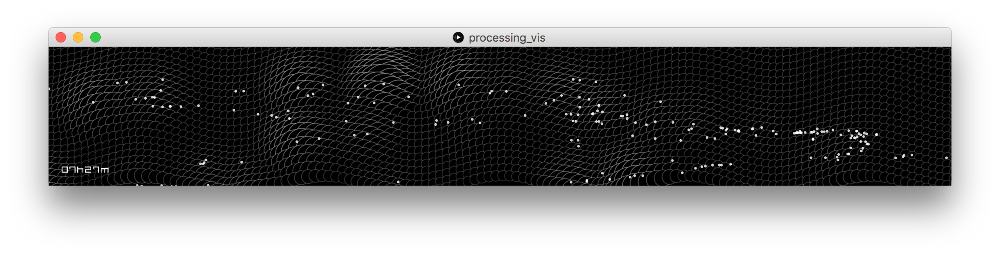

Nesta visualização vemos como os dados coletados dos GPS dos ônibus em um período de até 24hs podem ser transformados em um Timelapse. A velocidade dos ônibus de uma mesma linha se somam e formam relevos na superfície que remete a um tecido cobrindo volumes dinâmicos. O painel representa de forma abstrata a área do porto e as zonas de maior relevo representam onde o transito está fluindo melhor no momento.

Autor: Marlus Araujo

